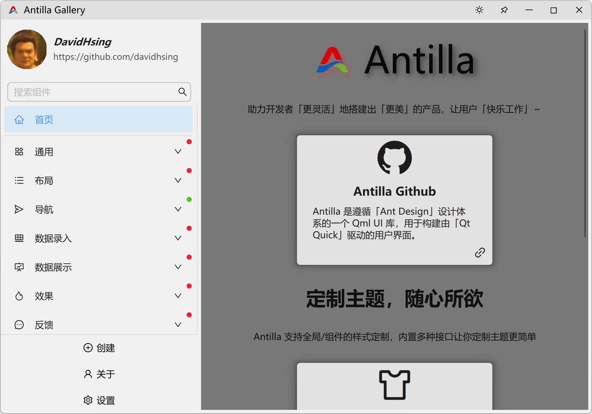
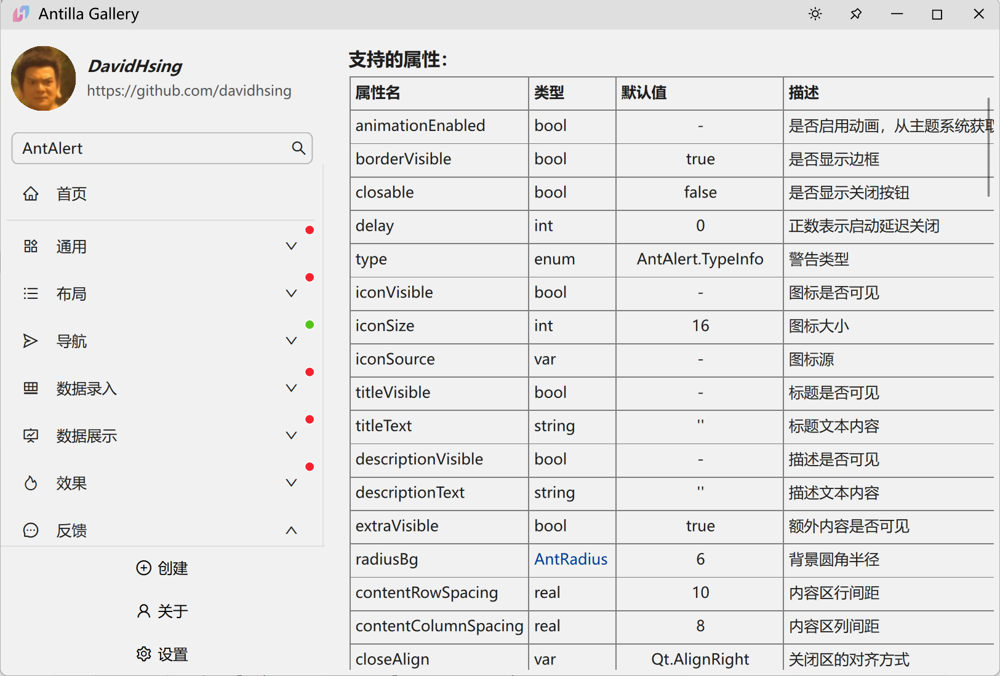

<div align=center>


# 「 Antilla 」 Modern UI for Qml 

Ant Design component library for Qt Qml

</div>

<div align=center>

English | [中文](./README-zh_CN.md)

</div>

<div align=center>

## 🌈 Gallery Preview





</div>

## ✨ Features

- 📦 A set of high-quality Qml components out of the box.
- 🎨 Powerful theme customization system.
- 💻 Based on Qml, completely cross-platform.
- 🔧 Highly flexible delegate based component customization.

## 🌐 Online wiki
- [Antilla Online wiki (AI)](https://deepwiki.com/davidhsing/qt-antilla)

## 🗂️ Precompiled package

Precompiled packages and binary libraries for two platforms, `Windows / Linux`, have been created.

Please visit [Release](https://github.com/davidhsing/qt-antilla/releases) to download.

## 🔨 How to Build

- Clone
```shell
git clone --recursive https://github.com/davidhsing/qt-antilla.git
```

- Update
```shell
git submodule update --remote --recursive
```

- Build
```shell
# Initialize MSVC Build Tools
"C:\Program Files (x86)\Microsoft Visual Studio\18\BuildTools\VC\Auxiliary\Build\vcvarsall.bat" x64
```

```shell
# cd Antilla
cmake -S . -B build -G "Ninja" -DCMAKE_BUILD_TYPE=Release -DBUILD_ANTILLA_STATIC_LIBRARY=OFF    # -DCMAKE_BUILD_TYPE=Debug
cmake --build build --target all --parallel --config Release    # --config Debug
# cmake --install build --prefix install
```

- Build with Ninja/MinGW
```shell
cmake -S . -B build -G "Ninja"
or
cmake -S . -B build -G "MinGW Makefiles"
```

> [!IMPORTANT]
> By default, `BUILD_ANTILLA_IN_DEFAULT_LOCATION=ON`:
> - the `headers` will be built in the `[QtDir]/[QtVersion]/[Kit]/include/Antilla` directory.
> - the `*.dll/*.so` will be built in the `[QtDir]/[QtVersion]/[Kit]/bin` directory.
> - the `*.lib` will be built in the `[QtDir]/[QtVersion]/[Kit]/lib` directory.
> - the `qmlplugin` will be built in the `[QtDir]/[QtVersion]/[Kit]/qml/Antilla` directory.

- Install
```shell
cmake --install --prefix <install_dir>
```

The installation directory structure
```auto
──<install_dir>
    ├─include
    │   *.h
    ├─bin
    │   *.dll
    ├─lib
    │   *.lib/so
    └─imports
        └─Antilla/Basic
```
- Usage
  - Link the `<install_dir>/lib`.
  - Include the `<install_dir>/include`.
  - Copy the `<install_dir>/bin/AntillaBasic.[dll/so]` to `[QtDir]/[QtVersion]/[Kit]/bin`.
  - Copy the `<install_dir>/imports/Antilla` to `[QtDir]/[QtVersion]/[Kit]/qml`.

## 📦 Get started 

 - Create QtQuick application `QtVersion >= 6.7`
 - Add the following cmake command to your project `CMakeLists.txt`
 ```cmake
  target_include_directories(<your_target> PRIVATE Antilla/include)
  target_link_directories(<your_target> PRIVATE Antilla/lib)
  target_link_libraries(<your_target> PRIVATE AntillaBasic)
 ```
 - Add the following code to your `main.cpp`
 ```cpp
  #include "antpp.h"

  int main(int argc, char *argv[])
  {
      ...
      /*! Set OpenGL, optional */
      QQuickWindow::setGraphicsApi(QSGRendererInterface::OpenGL);
      QQuickWindow::setDefaultAlphaBuffer(true);
      ...
      QGuiApplication app(argc, argv);
      QQmlApplicationEngine engine;
      AntApp::initialize(&engine);
      ...
  }
 ```
- Add the following code to your `.qml`
 ```qml
  import Antilla.Basic
  AntWindow { 
    ...
  }
 ```
 Alright, you can now enjoy using Antilla.

## 🚩 Reference

- Ant-d Components: https://ant-design.antgroup.com/components/overview
- Ant Design: https://ant-design.antgroup.com/docs/spec/introduce

## 💓 LICENSE

Use `MIT LICENSE`

## 🌇 Environment

Windows 11 / Ubuntu 24.04.2, Qt Version >= 6.7

## 🎉 Star History

[](https://star-history.com/#davidhsing/qt-antilla&Date)